Einen Cluster in iMKE anzulegen benötigt nur ein paar Klicks.
Doch bevor wir dies tun können, benötigen wir ein Projekt.

Hierfür werden wir folgende Dinge in iMKE anlegen:

* ein Projekt zur Verwaltung
* ein Kubernetes Cluster

Wir brauchen sowohl ein Projekt zur Verwaltung, als auch einen Cluster.
Ein Cluster gehört immer zu einem Projekt, aber wir können beliebig viele
Projekte haben, in denen es (noch) keine Cluster gibt.

## Projekt anlegen

Ein Projekt ist eine Zusammenfassung mehrerer Cluster mit gemeinsamen
Benutzern, die sich die Administration teilen. Projekte sind nur für
die Verwaltung wichtig und haben technisch keine Auswirkungen auf das
später angelegte Kubernetes Cluster.

Nach dem Login in iMKE erscheint folgendes Fenster, in dem wir auf
`Add Project` klicken müssen.
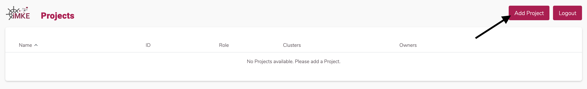

Danach öffnet sich ein Fenster, in dem wir dem Projekt einen Namen geben.
Als Beispiel verwenden wir hier `Team Kubernetes`.
Im zweiten Schritt muss dann auf `Save` geklickt werden.

Im Anschluss legt iMKe das Projekt an und stellt es in der Übersicht dar.
Mit einem Klick auf den Eintrag `Team Kubernetes` sind wir
im Projekt-Umfeld und können das Cluster anlegen.

Die folgende Seite stellt das Projekt dar. Hier sind alle bereits
bestehenden Cluster sowie zugehörige User und weitere Kontroll-Mechanismen
sichtbar.

Mit einem Klick auf die Seitenleiste links öffnen wir die Navigation im
Projekt-Umfeld und können die weiteren Bereiche erkunden.

## Das Cluster erstellen

Um einen Cluster anzulegen, klicken wir oben rechts auf `Add Cluster`.
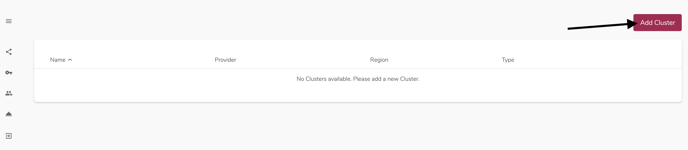

Jetzt öffnet sich die erste Seite für den Prozess, einen Cluster anzulegen.
Im Beispiel nennen wir unseren Cluster `first-system` und wählen die Kubernetes
Version 1.15.0 aus:
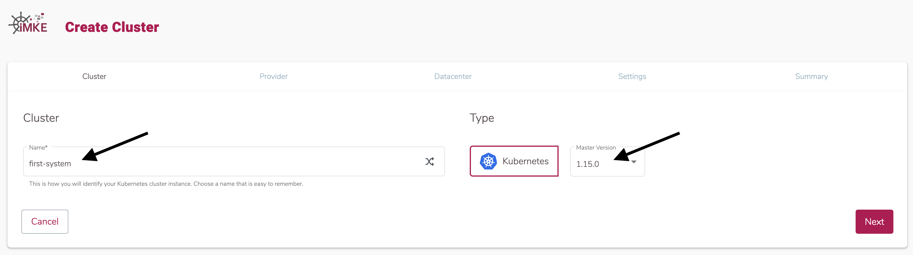

Wir klicken dann auf `Next` und im nächsten Schritt wählen wir den Provider
`openstack` und eine der drei Verfügbarkeitszonen aus, in diesem Beispiel
nehmen wir `IX1`:

Aktuell gibt es in iMKE nur iNNOVO Cloud OpenStack als mögliches Ziel für das
Cluster. Dafür klicken wir auf `openstack` und wählen dann eine der drei Zonen
aus. In diesem Beispiel `IX1`.
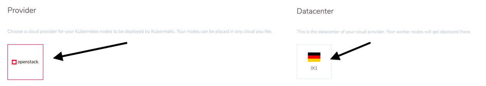

Damit iMKe in der OpenStack Plattform die notwendigen Ressourcen erzeugen kann,
geben wir hier erneut unsere Zugangsdaten ein. Danach wird der Inhalt in `Project`
automatisch aktualisiert und wir können unser gewünschtes OpenStack Projekt
auswählen:
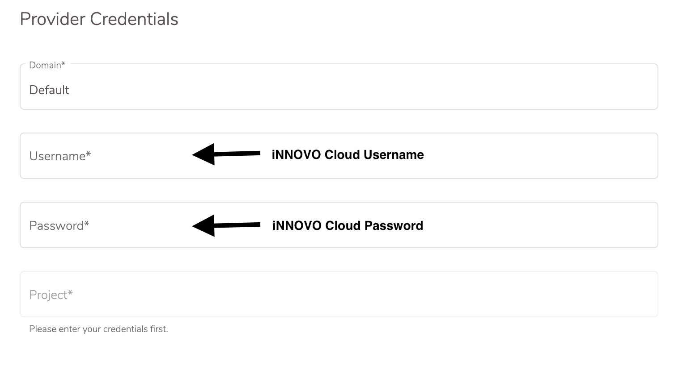
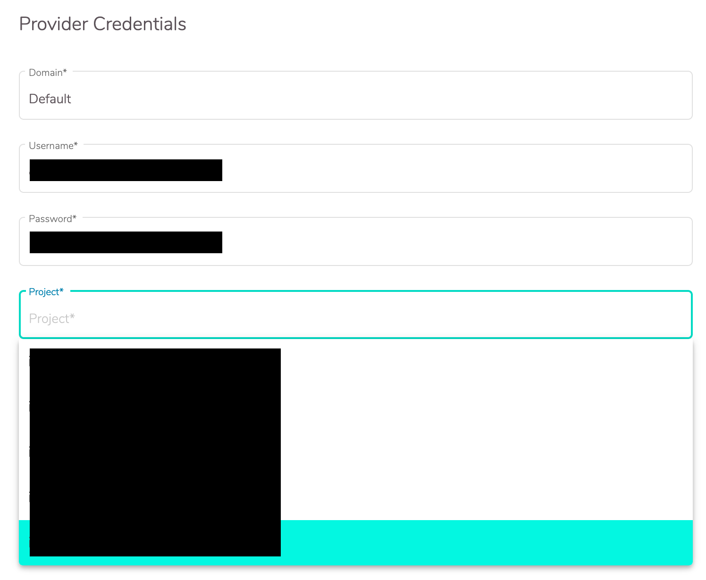

In den Node Settings konfigurieren wir, wie viele Server später im Kubernetes Cluster
als Nodes verwendet werden können. Diese Gruppe von Servern braucht einen Namen und
eine Größe. Für den ersten Cluster sind genaue Namen nicht so wichtig, deswegen benutzen
wir den Namensgenerator. Die Anzahl und Größe der Server belassen wir auf den
Standardwerten.
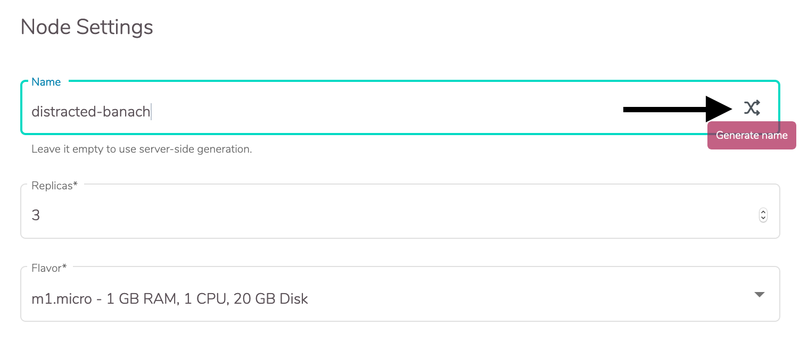

Um später per SSH auf die Instanzen zuzugreifen, wählen wir Allocate Floating IP
aus. Als Image entscheiden wir uns für Container Linux. Container Linux ist
speziell für den Betrieb von Containern gedacht und wird durch iMKe automatisch
aktualisiert.
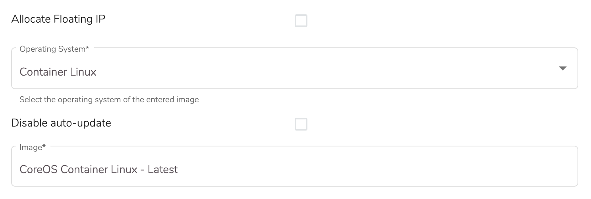

Für den SSH Zugriff müssen wir unseren Schlüssel hinterlegen. Dafür klicken wir auf
`Add SSH Key` und tragen in dem Dialog der sich öffnet unseren SSH Public Key ein
und geben ihm einen passenden Namen:
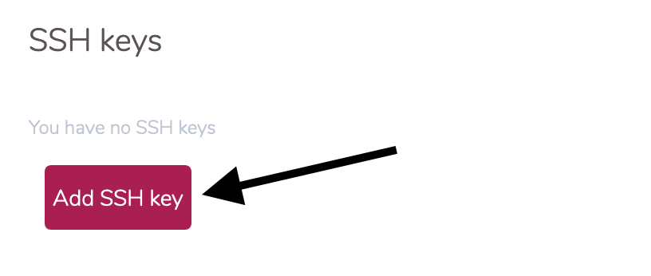
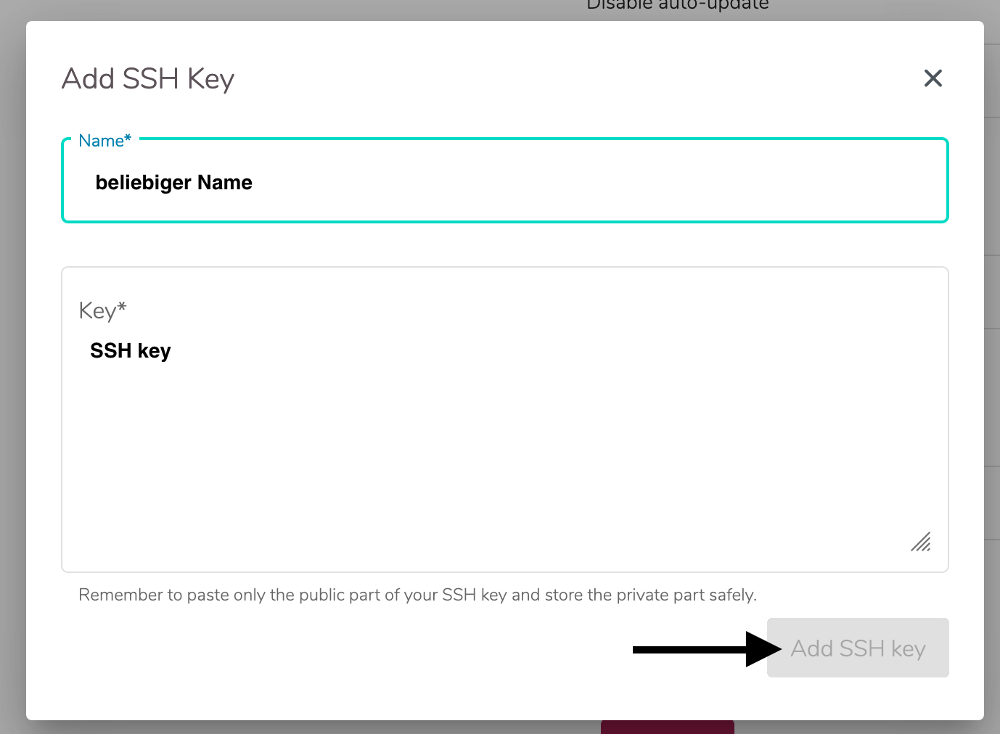

Zum Schluss klicken wir wieder auf `Next` und nachdem wir alle Informationen
noch einmal geprüft haben auf `Create`.
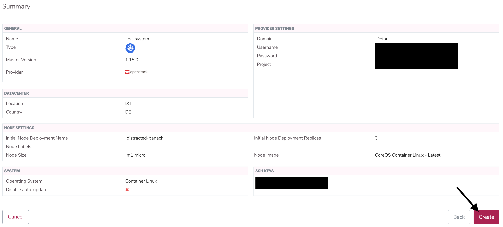

Nun wird das Cluster erstellt. Um auf die Informationen zugreifen zu können müssen
wir nun wieder auf die Cluster-Übersicht des Projektes und dort auf unser Cluster
schicken.
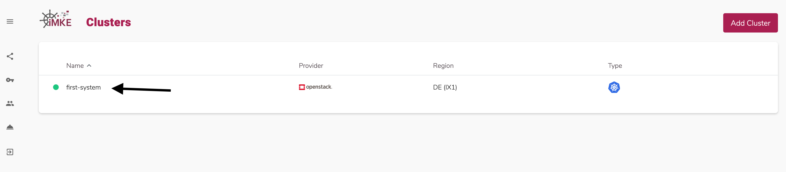
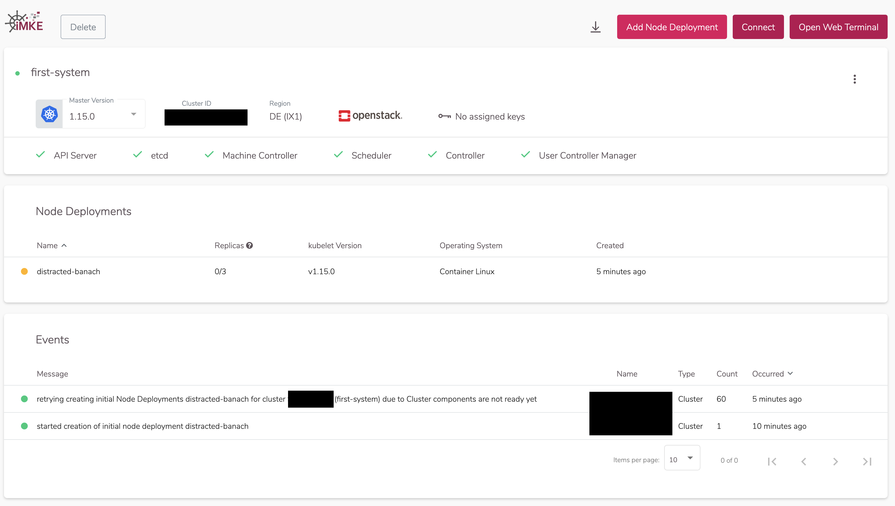

## Zusammenfassung

Folgende Schritte wurden erfolgreich durchgeführt und gelernt:

* Was ist ein Projekt in iMKE
* Wie legt man ein Projekt in iMKE an
* Was ist ein iMKE Cluster
* Wie konfiguriert man ein iMKE Cluster
* Wie startet man ein iMKE Cluster

Herzlichen Glückwunsch! Dies sind alle notwendigen Steps um ein Kubernetes Cluster
in iMKE anzulegen. Wie dieses verwendet werden kann steht auf den nächsten Seiten.