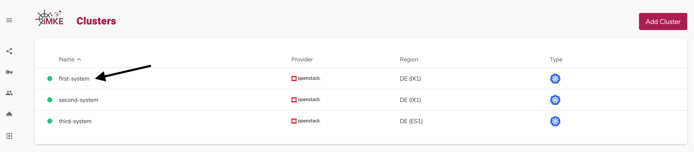
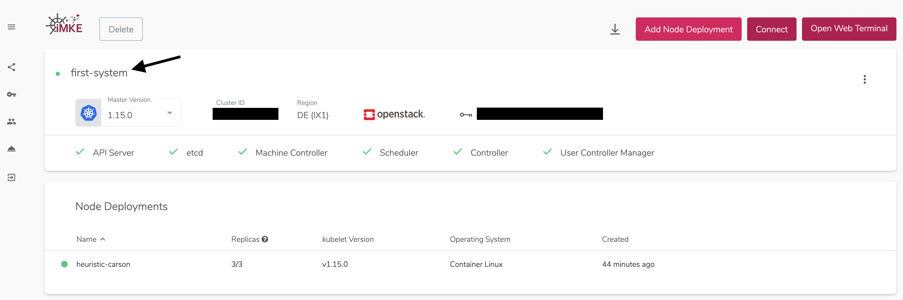
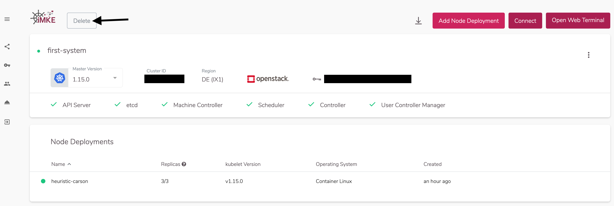
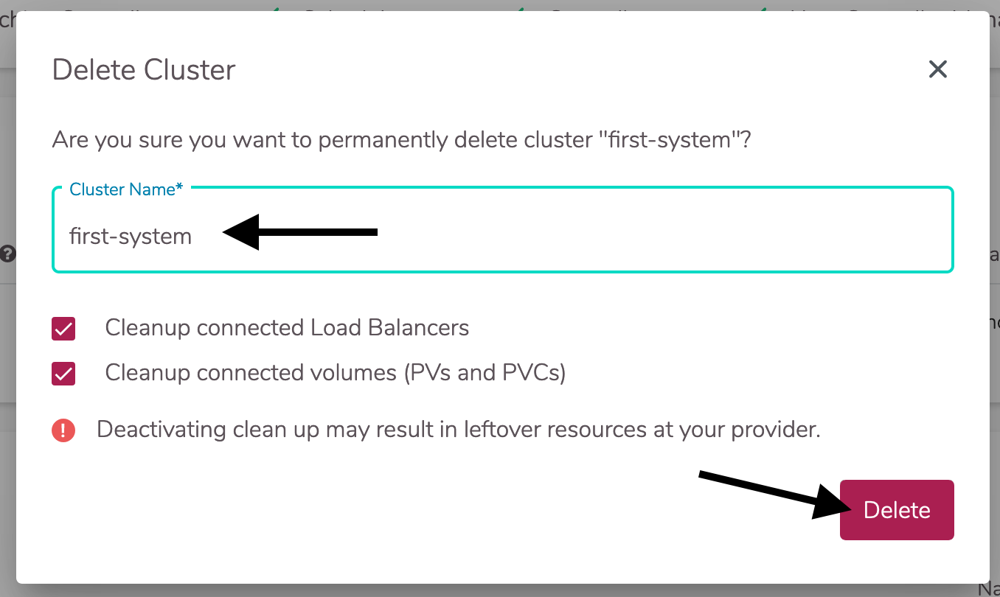

Einen Cluster in iMKE zu löschen ist sehr schnell machbar.
Die Vorraussetzung für diesen Guide ist ein existierendes
Cluster in einem Projekt.

## Das Cluster finden

Um ein Cluster zu löschen müssen wir in die Detailansicht
des Clusters gehen.
Hierfür klicken wir auf den Eintrag `first-system`.

Folgend müssen wir uns den Cluster-Namen merken. Um diesen
in die Zwischenablage zu kopieren klicken wir auf den Namen.

## Das Cluster löschen

Nun klicken wir auf `Delete`.

In dem sich nun öffnenden Fenster wird als Sicherheitsfrage
der Cluster-Name angefragt. Da wir diesen zwei Schritte vorher
schon in die Zwischenablage kopiert haben müssen wir diesen
nun nur noch einfügen.

Da wir alles löschen wollen lassen wir die zwei Checkboxen
angehakt. Damit werden auch Volumes und LoadBalancer in
OpenStack gelöscht.

## Zusammenfassung

Folgende Schritte wurden erfolgreich durchgeführt und gelernt:

* Wie lösche ich ein Projekt
* Wie räume ich auch in OpenStack alle zugehörigen Elemente weg.

Herzlichen Glückwunsch! Dies sind alle notwendigen Steps um ein Kubernetes Cluster
in iMKE zu löschen.
