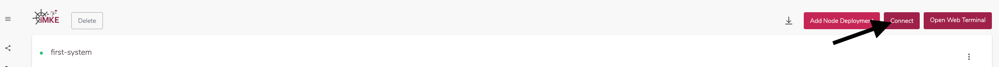
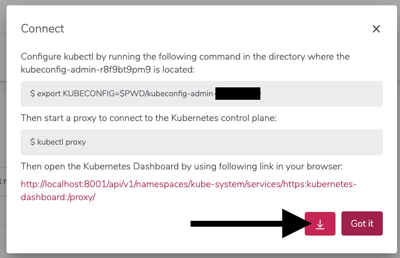
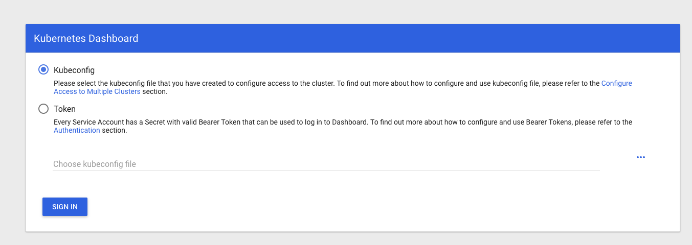
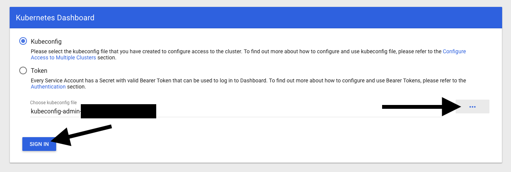
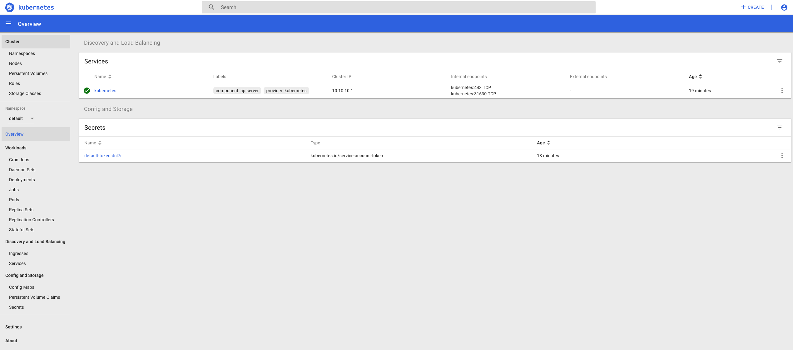

After we created a cluster in iMKE, it is time to connect to
it. This is necessary to deploy and manage our applications.

*Note: The following guide does not work with kubectl versions
below `1.13`. Please make sure to update or alternately, use 
our Webterminal!*

## Finding our Cluster

To find a cluster, we need to go to the detail view of the cluster.
For that, we click on the entry `first-system`.


## Getting Access

We click `Connect` on the top right and in the window that opens,
we click on the downwards facing arrow.




This way we download a file which is called `kubeconfig` in
kubernetes jargon. This file contains all end points, certificates
and other information about the cluster. The `kubectl`command uses
this file to connect to the cluster.

To use the `kubeconfig`, we need to register it on the console.
There are two ways to do this:

1. `kubectl` by default tries to use the file `.kube/config`
   in your home directory.
2. We can temporarily use the `kubeconfig` by exporting it to
   an environment variable.

To keep things straightforward and to avoid changing standards
on our system, we choose variant 2 in the example.

For this we need to open a Terminal. In the screenshots we use
iTerm2 on macOS, but the examples work the same way when using
bash on Linux or Windows.

First, we need to find the downloaded `kubeconfig` file. Browsers
like Chrome or Firefox usually store it in the Downloads folder.
The name is constructed from two parts:
 
 * `kubeconfig-admin-`
 * the cluster id.
 
 To register the kubeconfig, we use the following command:o:

```bash
cd Downloads
export KUBECONFIG=$(pwd)/kubeconfig-admin-CLUSTERID
```

This command is also shown in the iMKE Web UI. In the connect window,
we click on the example to copy it into our paste buffer.


Now we can interact with the cluster. The simplest command is: Show
all the nodes that comprise my cluster:

```bash
kubectl get nodes

NAME                           STATUS   ROLES    AGE   VERSION
musing-kalam-XXXXXXXXX-ks4xz   Ready    <none>   10m   v1.15.0
musing-kalam-XXXXXXXXX-txc4w   Ready    <none>   10m   v1.15.0
musing-kalam-XXXXXXXXX-vc4g2   Ready    <none>   10m   v1.15.0
```

## Kubernetes Dashboard

In iMKE we start the Kubernetes Dashboard by default. To open it in
a local browser, we need to tunnel to the API of our cluster. Again,
we use `kubectl` to achieve this:

```bash
kubectl proxy
```

This will open localhost:8001 on our local machine. We can now talk
to the Kubernetes API by connecting to port 8001. The same tunnel
also grants access to the Kubernetes Dashboard, which is available via
the following URL:

[http://localhost:8001/api/v1/namespaces/kube-system/services/https:kubernetes-dashboard:/proxy/](http://localhost:8001/api/v1/namespaces/kube-system/services/https:kubernetes-dashboard:/proxy/)


On the login screen, we keep the `kubeconfig` box checked and at
`Choose kubeconfig file` we choose the previously downloaded file.
After that, we click on `SIGN IN`.


Now we see the Kubernetes Dashboard and can explore our cluster
graphically.


When we're done, we stop the connection to the cluster by termininating
kubectl, simply hitting Control-C.

## Summay

We successfully learnt and did the following:

* How to get the `kubectl` configuration file
* How to configure `kubectl` to use the `kubeconfig`file
* How to access the Kuberneres Dashboard for a cluster

Congratulations! Now you know all that's needed to connect to a
Kubernetes Cluster.
