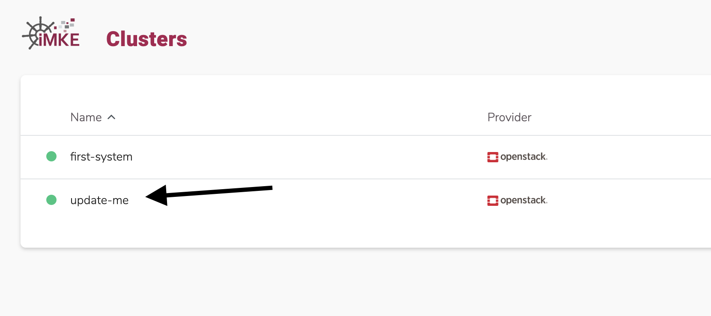
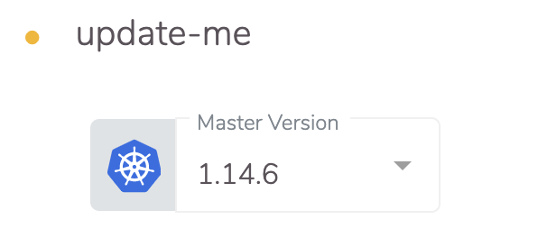
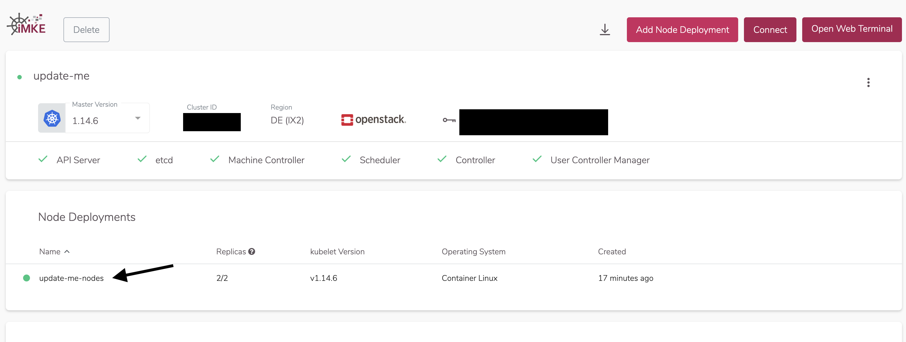
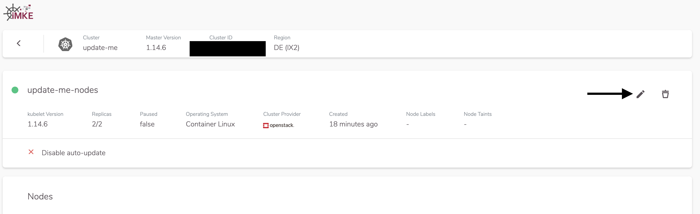
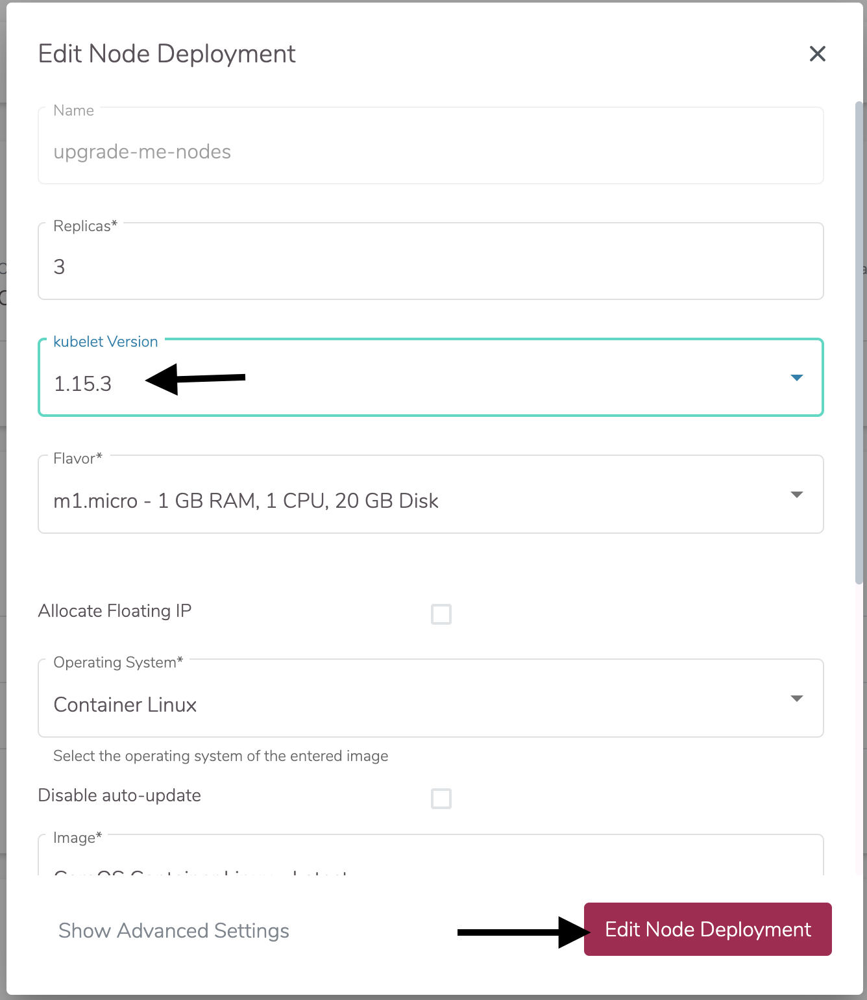

Cluster security is paramount, and new features come with
each release. In order to stay safe and up-to-date, means
installing updates on a regular basis.

In especially critical cases, we will automatically update the
Cluster API to the latest Minor-Version in order to keep our
own infrastructure up-to-date. In this case the following *The
Cluster* can be skipped. However, nodes must still be updated
manaully by you.

## The Cluster

In Kubernetes the infrastructure is divided into master and nodes.
The master is managed by iMKE itself.

Since several versions for the master are offered, you have the
possibility to choose the version in iMKE's web interface. An
update of the master can be accomplished with a few mouse clicks.

First, we select the cluster which we'd like to update.


Then we click on the field `Master Version` and choose a new
version for the master.


Now iMKE automatically updates the master, and we are done with this
step.

## The Nodes

After the master has completed updating, we must still update the
nodes. The iMKE web interface can help us here as well. 

It's worth noting that this update process deletes the old nodes and
replaces them with new ones. This also means that all pods will be
restarted.

The first step is to click on the node deployment.


Next we click on the pencil icon to open the update view.


Now, under `kubelet Version` we select the version, for example 
`1.15.3`, which matches the cluster's master version. Confirm the
update by clicking `Edit Node Deployment`


Now iMKE will automatically update the node group to the new version,
amd Kubernetes will take care of deploying your applications to the
new nodes.

## Two Node Cluster

Watch out for clusters with two nodes or fewer. iMKE uses a rolling update
strategy. This means one node after another is swapped. In a cluster
with two or fewer nodes that means that the first updated node must
be fully scheduled before the second one is ready.

As a solution to this is a simple bash script, which per-namespace triggers
the regeneration of all pods.
https://github.com/truongnh1992/playing-with-istio/blob/master/upgrade-sidecar.sh

We can use this as soon as the cluster has completed updating in the web interface.

```bash
curl -o upgrade-node.sh https://raw.githubusercontent.com/truongnh1992/playing-with-istio/master/upgrade-sidecar.sh
chmod +x upgrade-node.sh
echo -e "#\!/bin/bash\n$(cat upgrade-node.sh)" > upgrade-node.sh
```

Now we must use this script on all of our namespaces.

```bash
kubectl get namespace
NAME              STATUS   AGE
default           Active   36m
kube-node-lease   Active   36m
kube-public       Active   36m
kube-system       Active   36m
webterminal       Active   4m42s

# So for default we would run
./upgrade-node.sh default
Refreshing pods in all Deployments
```

Now all pods are cleanly distributed across our nodes.
