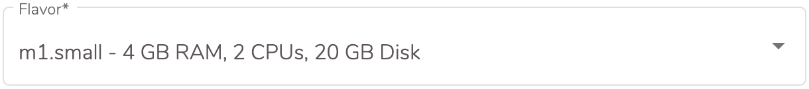
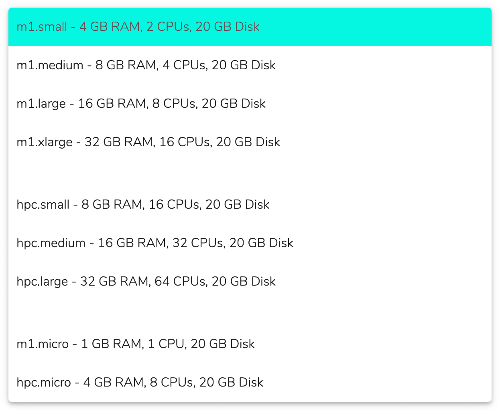
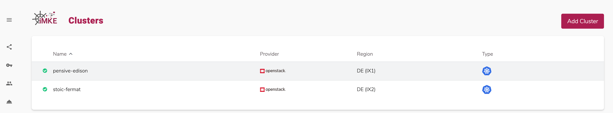
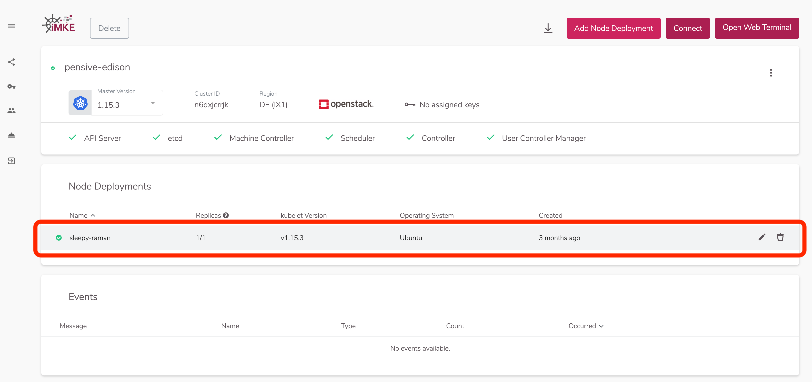
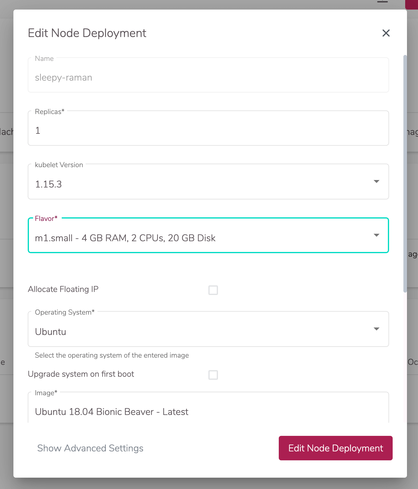

Während der Erstellung von Nodes in einem Cluster kann man sich zwischen diversen sogenannten "Flavors" entscheiden.

	
Flavors bestimmen die Anzahl an Prozessorkernen ("CPUs") und Speicher ("GB RAM"), sowie die Festplattengröße ("GB Disk") der entsprechenden Node.

Hilfreich bei der Auswahl des richtigen Flavors sind die folgenden, wiederholbaren Schritte:
1. Zunächst startet man mit kleinen Flavors.
2. Dann evaluiert man die Performanz des geplanten Projektes mit diesem Flavor.
3. Treten Probleme auf, so wechselt man auf einen höheren Flavor.
 
## Flavors ändern

Der Wechsel auf einen anderen Flavor ist denkbar einfach:

1. Zuerst navigiert man in den gewünschten Cluster.

    

2. Nun klickt man auf das Editieren-Icon derjenigen Node, deren Flavor man ändern möchte. Das Icon erscheint dabei erst dann, wenn man mit der Maus über die entsprechende Node fährt.

    

3. In dem jetzt geöffneten Fenster selektiert man dann den gewünschten Flavor und klickt zuletzt auf "Node Deployment editieren", um den Prozess abzuschließen.

    

Kurz danach erscheint eine Bestätigungsnachricht auf Ihrem Bildschirm und der Flavor wurde erfolgreich geändert.